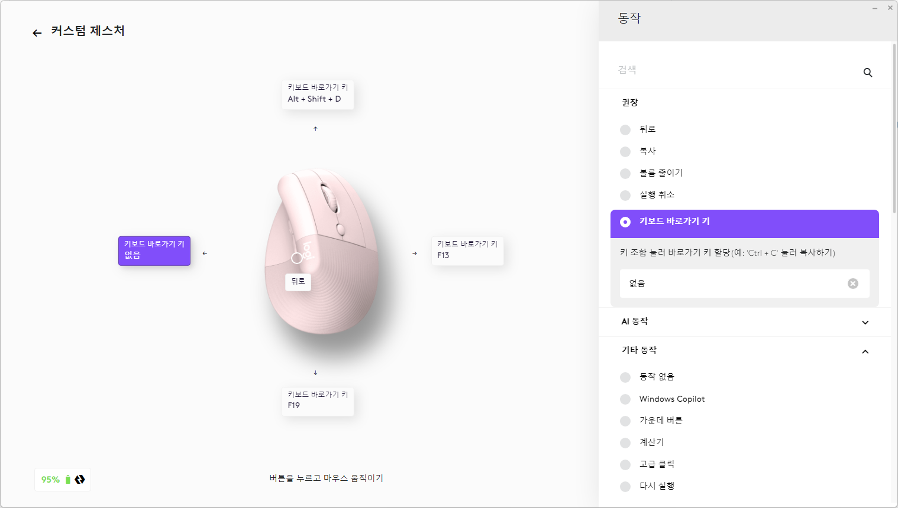
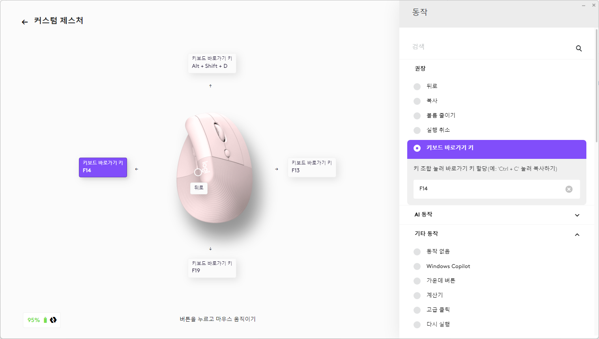
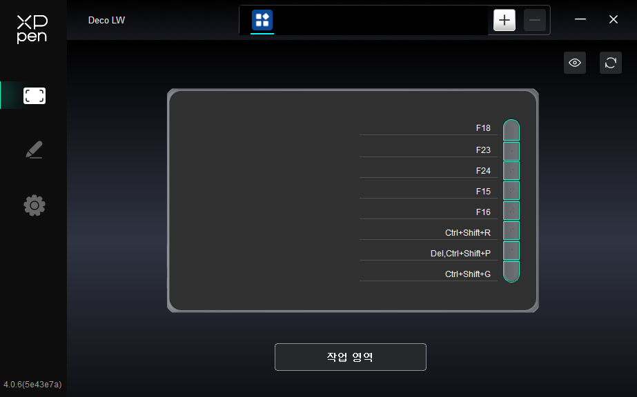
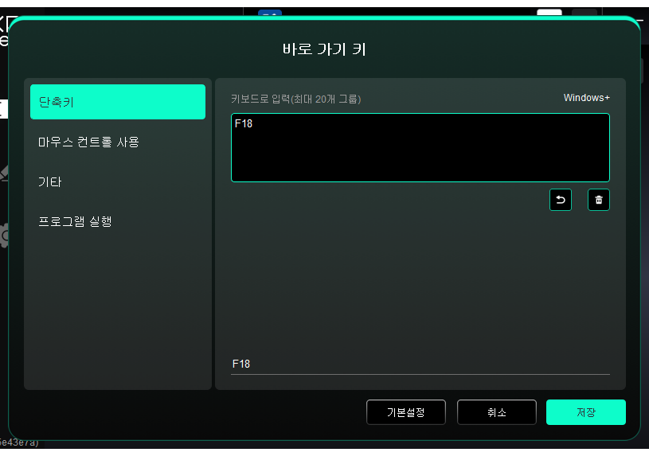

# 🚀 My Utility Scripts (개발 유틸리티 스크립트 모음)

일상적인 개발 및 컴퓨터 사용 시 불편한 점들을 자동화하기 위해 만든 스크립트 모음집입니다.

## 1. AutoHotkey Scripts

### (1) 개요 (Overview)

이 프로젝트의 핵심은 로지텍 마우스나 XP-Pen 타블렛 같은 **하드웨어의 추가 버튼**에 **F13~F24 같은 특수 키**를 할당하고, 메인 스크립트(`global_hotkeys.ahk`)가 이 입력을 감지하여 복잡한 작업을 수행하도록 하는 것입니다.

이를 위해 두 개의 스크립트 파일을 제공합니다.

* **`global_hotkeys.ahk`**:
    메인 스크립트입니다. F13~F24 키 입력이 할당된 하드웨어가 있을 때 사용합니다.
* **`hotkey_input_simulator.ahk`**:
    하드웨어 설정을 돕거나 메인 스크립트의 기능을 테스트하기 위한 '가상 키 입력' 보조 스크립트입니다.

### (2) 필수 설정 (Prerequisites & Setup)

`global_hotkeys.ahk`를 사용하려면, 먼저 하드웨어(마우스 등)의 버튼에 F13~F24 키를 할당해야 합니다.

#### 🖱️ 로지텍 마우스 설정 (예시: F14 할당)

1.  로지텍 G HUB (또는 Logi Options+) 설정에서 할당하려는 버튼을 선택합니다.
2.  "키보드 바로 가기 키" 할당 메뉴로 이동합니다. (`setup-for-logitech-1.png` 참고)
3.  할당할 키를 입력받는 창이 뜨면, **키보드를 누르는 대신** `hotkey_input_simulator.ahk` 스크립트를 수정하여 실행합니다.

    * **방법:**
        1.  `hotkey_input_simulator.ahk` 파일을 메모장으로 열어, `Send("{F14}")` 처럼 원하는 F-key로 수정합니다. (F13~F24 권장)
        2.  `global_hotkeys.ahk`가 꺼져있는지 확인하고, `hotkey_input_simulator.ahk`를 실행합니다.
        3.  3초마다 스크립트가 가상 키(F14)를 입력해줍니다.
        4.  로지텍 설정 창이 이 입력을 자동으로 감지하여 버튼에 F14 키가 할당됩니다. (`setup-for-logitech-2.png` 참고)

| 로지텍 설정 (1) | 로지텍 설정 (2) |
| :---: | :---: |
|  |  |

#### 🖊️ XP-Pen 타블렛 설정 (예시: F18 할당)

XP-Pen 타블렛 설정도 동일한 원리로 F-Key를 할당할 수 있습니다.

1.  타블렛 설정 창에서 키를 할당할 버튼을 클릭합니다. (`xppen-fkey-setup-01.png` 참고)
2.  "키보드에서 정의" 창의 입력 칸을 클릭합니다. (`xppen-fkey-setup-03.png` 참고)
3.  `hotkey_input_simulator.ahk` 스크립트의 키를 `F18` 등으로 변경하고 실행하면, 입력 칸이 가상 입력을 감지하여 키가 할당됩니다. (`xppen-fkey-setup-02.png` 참고)

| XP-Pen 설정 (1) | XP-Pen 설정 (2) | XP-Pen 설정 (3) |
| :---: | :---: | :---: |
|  |  |  |

---

### (3) 주요 기능 (`global_hotkeys.ahk`)

위 설정이 완료된 후, `global_hotkeys.ahk`를 실행하면 아래의 기능들을 사용할 수 있습니다.

#### ✨ 주요 기능 상세 (Showcase)

* **`!+d`: 오디오 출력 장치 토글 (스피커 ↔ 헤드셋)**
    * **해결한 문제:** Windows에서 기본 오디오 장치를 스피커와 헤드셋 간에 빠르게 전환하기가 번거로웠습니다.
    * **구현 방법:** 외부 유틸리티인 `NirCmd.exe`를 AHK의 `RunWait` 명령어로 호출하여 이 기능을 구현했습니다. (`NirCmd.exe`가 `C:\NirCmd\` 경로에 필요합니다.) 또한, 각 장치(스피커, 헤드셋)가 활성화될 때 `setsysvolume` 명령어로 미리 설정된 개별 볼륨 레벨이 자동으로 적용되도록 했습니다.

#### Hotkey 목록

* **로지텍 마우스 연동 (F13~F19 할당 필요)**
    * `F19`: 가상 데스크톱(Win+Tab) 간 전환
    * `F13`, `F14`: `NegativeScreen` 프로그램과 연동하여 커스텀 색상 필터(녹색/연두색) 모드를 순환 및 토글
* **XP-Pen 타블렛 연동 (F17, F18, F23, F24 할당 필요)**
    * `F17`: `Xournal` 프로그램의 도구(펜-지우개-스크롤)를 순서대로 전환
    * `F18`: `Alt+Tab` 기능 실행
    * `F23`, `F24`: Adobe Acrobat Reader 창을 타겟하여 스크롤 업/다운
* **시스템 제어**
    * `!+s` / `!+a`: 시스템 볼륨을 한 단계씩 높이거나 낮춥니다. (NirCmd 필요)
    * `^!o`: **집중 모드 토글.** 삼중 모니터 환경에서 중앙 모니터를 제외한 양쪽 보조 모니터를 검은색 화면으로 가려줍니다.